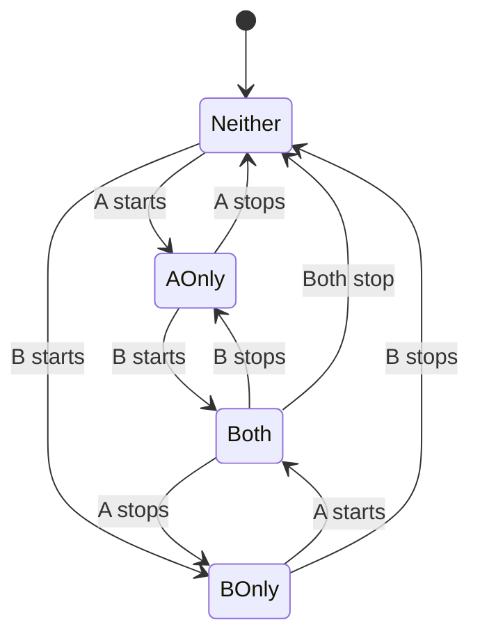

## Overview

preload-rs uses a Markov chain model to predict which executables and files will be needed in the next cycle. The model tracks **pairwise relationships** between executables to capture correlation patterns in application behavior.

The predictor is implemented in `crates/orchestrator/src/prediction/predictor.rs`.

## Markov State Machine

Each edge between two executables (A, B) maintains a 4-state Markov chain tracking their combined running states:



### State Enumeration

```rust
pub enum MarkovState {
    Neither = 0,  // Neither A nor B running
    AOnly = 1,    // Only A running
    BOnly = 2,    // Only B running
    Both = 3,     // Both A and B running
}
```

`crates/orchestrator/src/domain/markov.rs:7-12`

## Edge Statistics

Each `MarkovEdge` tracks:

```rust
pub struct MarkovEdge {
    pub state: MarkovState,              // Current state
    pub last_change_time: u64,           // Time of last transition
    pub state_last_left: [u64; 4],       // Last exit time for each state
    pub time_to_leave: [f32; 4],         // Expected dwell time (exponential mean)
    pub transition_prob: [[f32; 4]; 4],  // P(next_state | current_state)
    pub both_running_time: u64,          // Total time both running together
}
```

`crates/orchestrator/src/domain/markov.rs:42-49`

### Time-to-Leave (TTL)
`time_to_leave[i]` is the exponentially-weighted mean of dwell times in state `i`. It represents the expected time before leaving that state.

### Transition Probabilities
`transition_prob[i][j]` is the exponentially-weighted probability of transitioning from state `i` to state `j`.

Note that diagonal entries (i=j) are not updated since transitions must change state.

## Exponential Decay

All statistics use exponential smoothing to give recent observations more weight than historical data.

### Decay Factor

The decay factor λ is computed from the configured half-life:

```rust
pub fn decay_factor(&self) -> f32 {
    if let Some(half_life) = self.half_life {
        return (2.0_f32.ln()) / half_life.as_secs_f32();
    }
    self.decay.max(0.0)
}
```

`crates/config/src/model.rs:51-60`

**Default:** `decay = 0.01` (half-life ≈ 69.3 seconds)

### Update Formula

When a transition occurs from `old_state` to `new_state` after dwelling `dt_since_change` seconds:

```rust
let mix_tt = (-decay * dt_since_left).exp();
let mix_tp = (-decay * dt_since_change).exp();

// Update time-to-leave
self.time_to_leave[old_ix] = mix_tt * self.time_to_leave[old_ix] 
                            + (1.0 - mix_tt) * dwell;

// Update transition probability
self.transition_prob[i][j] = mix_tp * self.transition_prob[i][j] 
                           + (1.0 - mix_tp) * p;
```

`crates/orchestrator/src/domain/markov.rs:76-89`

Where:
- `mix_tt` = weight for old TTL estimate
- `mix_tp` = weight for old transition probability
- `p` = 1.0 for the observed transition, 0.0 for others

<Note>
Exponential decay ensures recent patterns dominate while retaining long-term learned behavior. Shorter half-lives adapt faster but are more volatile.
</Note>

## Active Set (Lazy Edges)

Markov edges are **lazy**: they exist only among executables in the active set.

```rust
pub struct ActiveSet {
    last_seen: HashMap<ExeId, u64>,  // Tracks last observation time
}
```

`crates/orchestrator/src/stores/active_set.rs:7-9`

### Active Window

Executables remain in the active set for `active_window` seconds after last observation.

**Default:** 6 hours (`21,600` seconds)

`crates/config/src/model.rs:42`

### Pruning Inactive Edges

Each cycle, the updater:
1. Updates active set with currently running executables
2. Prunes executables outside the window
3. Prunes Markov edges referencing inactive executables

```rust
stores.active.update(active_exe_ids.iter().copied(), now);
let _removed = stores.active.prune(now, self.active_window);
let active = stores.active.exes();
stores.markov.prune_inactive(&active);
```

`crates/orchestrator/src/observation/model_updater.rs:150-153`

This prevents O(N²) edge growth as the total number of tracked executables increases. Edges are recreated automatically when executables re-enter the active set.

## Prediction Algorithm

The predictor computes `P(exe_i needed in next cycle)` for each executable.

### Step 1: Compute "Not Needed" Probabilities

For each Markov edge (A, B) and each non-running executable:

```rust
fn p_needed(
    edge: &MarkovEdge,
    state: MarkovState,
    target_state: MarkovState,
    cycle: f32,
) -> f32 {
    let state_ix = state.index();
    let tt = edge.time_to_leave[state_ix];
    if tt <= 0.0 {
        return 0.0;
    }
    
    // P(state change within cycle)
    let p_state_change = 1.0 - (-cycle / tt).exp();
    
    // P(transition leads to target running)
    let target_ix = target_state.index();
    let both_ix = MarkovState::Both.index();
    let p_runs_next = edge.transition_prob[state_ix][target_ix] 
                    + edge.transition_prob[state_ix][both_ix];
    
    (p_state_change * p_runs_next).clamp(0.0, 1.0)
}
```

`crates/orchestrator/src/prediction/predictor.rs:51-68`

This computes the probability that the Markov chain will transition to a state where the target executable is running within one cycle.

### Step 2: Aggregate Evidence Across Edges

For each non-running executable, we accumulate evidence from all edges:

```rust
let mut not_needed: HashMap<ExeId, f32> = HashMap::new();

for (key, edge) in stores.markov.iter() {
    let a = key.a();
    let b = key.b();
    let state = MarkovState::from_running(a_running, b_running);
    
    if !a_running {
        let base = Self::p_needed(edge, state, MarkovState::AOnly, cycle_secs);
        let corr = self.correlation(stores, a, b, edge.both_running_time).abs();
        let p = (base * corr).clamp(0.0, 1.0);
        
        let entry = not_needed.entry(a).or_insert(1.0);
        *entry *= 1.0 - p;  // Product of (1 - p_needed)
    }
}
```

`crates/orchestrator/src/prediction/predictor.rs:73-93`

The final "needed" probability is:

```rust
let not_needed_prob = not_needed.get(&exe_id).copied().unwrap_or(1.0);
let needed = (1.0 - not_needed_prob).clamp(0.0, 1.0);
```

`crates/orchestrator/src/prediction/predictor.rs:113-114`

This treats multiple edges as **independent evidence** and combines them using the complement rule.

## Correlation Between Applications

When `use_correlation = true` (default), the predictor weights edge evidence by correlation strength.

### Correlation Formula

For executables A and B with `both_running_time` = T_AB:

```rust
fn correlation(&self, stores: &Stores, a: ExeId, b: ExeId, ab_time: u64) -> f32 {
    let t = stores.model_time;
    let a_time = stores.exes.get(a).map(|e| e.total_running_time).unwrap_or(0);
    let b_time = stores.exes.get(b).map(|e| e.total_running_time).unwrap_or(0);
    
    if t == 0 || a_time == 0 || b_time == 0 || a_time >= t || b_time >= t {
        return 0.0;
    }
    
    let numerator = (t as f32 * ab_time as f32) - (a_time as f32 * b_time as f32);
    let denom = (a_time as f32 * b_time as f32 * (t - a_time) as f32 * (t - b_time) as f32).sqrt();
    
    if denom == 0.0 { 0.0 } else { numerator / denom }
}
```

`crates/orchestrator/src/prediction/predictor.rs:28-49`

This computes a normalized correlation coefficient measuring how much A and B co-occur beyond what would be expected by chance.

<Note>
High correlation (≈1.0) means A and B frequently run together. Low correlation (≈0.0) means their running times are independent. The absolute value is used since negative correlation also carries information.
</Note>

### Applying Correlation

Each edge's prediction is weighted by correlation:

```rust
let base = Self::p_needed(edge, state, target_state, cycle_secs);
let corr = if self.use_correlation {
    self.correlation(stores, a, b, edge.both_running_time).abs()
} else {
    1.0
};
let p = (base * corr).clamp(0.0, 1.0);
```

`crates/orchestrator/src/prediction/predictor.rs:84-90`

This downweights edges between weakly-correlated executables, reducing noise from spurious co-occurrences.

## Map Scores

Map scores are derived from executable scores using the **union probability**:

```rust
// Map scores derived from exe scores (Pr map needed)
for (map_id, _map) in stores.maps.iter() {
    let mut not_needed_prob = 1.0;
    for exe_id in stores.exe_maps.exes_for_map(map_id) {
        let exe_score = prediction.exe_scores.get(&exe_id).copied().unwrap_or(0.0);
        not_needed_prob *= 1.0 - exe_score;
    }
    let needed = (1.0 - not_needed_prob).clamp(0.0, 1.0);
    prediction.map_scores.insert(map_id, needed);
}
```

`crates/orchestrator/src/prediction/predictor.rs:119-128`

A map is needed if **any** of the executables that use it are predicted to run.

## Configuration

Key model parameters in `config.toml`:

```toml
[model]
cycle = 20                    # Cycle length in seconds
use_correlation = true        # Weight edges by correlation
active_window = 21600         # Active set window (6 hours)
half_life = 120               # Exponential decay half-life (overrides decay)
decay = 0.01                  # Decay factor if half_life not set
```

## Example: Prediction Flow

Consider three executables: **firefox**, **firefox-bin**, **X11**

1. User launches **firefox**, which spawns **firefox-bin**
2. Both use **X11** display server
3. After several cycles:
   - Edge (firefox, firefox-bin): High correlation, high transition probability
   - Edge (firefox, X11): Medium correlation
   - Edge (firefox-bin, X11): Medium correlation

4. Next cycle with only **firefox** running:
   - **firefox-bin**: High probability (strong sequential relationship)
   - **X11**: Medium probability (needed for display)

5. Planner selects libraries for **firefox-bin** and **X11** to prefetch

## Related Topics

- [Architecture Overview](/architecture/overview) — System architecture and pipeline
- [Persistence](/architecture/persistence) — How Markov edges are persisted
