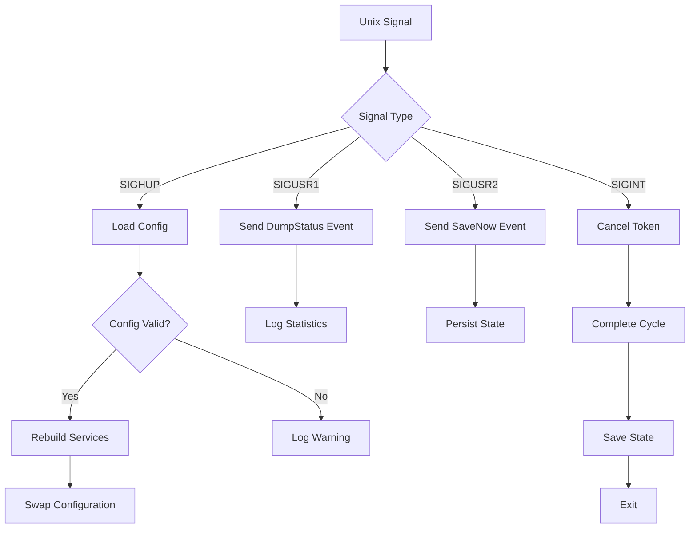

## Overview

preload-rs responds to Unix signals for runtime control without requiring a restart. This allows you to reload configuration, trigger state saves, and dump status information while the daemon is running.

<Note>
  Signal handling is only available on Unix-like systems (Linux, macOS, BSD). On other platforms, these signals are not supported.
</Note>

## Supported Signals

### SIGHUP - Reload Configuration

**Signal:** `SIGHUP` (Hangup)

**Purpose:** Reload configuration from disk and rebuild runtime services.

**Behavior:**
1. Reads all configuration files from disk (using the same paths as startup)
2. Parses and validates the new configuration
3. Rebuilds the admission policy, model updater, predictor, planner, and prefetcher
4. Swaps in the new configuration without restarting the daemon

If configuration loading fails, preload-rs logs a warning and continues with the existing configuration.

**Example:**
```bash
# Send SIGHUP to reload config
kill -HUP $(pidof preload-rs)

# Or using systemctl
systemctl reload preload-rs
```

**Use Cases:**
- Adjust prediction parameters without downtime
- Modify memory policy or prefetch concurrency
- Update path filters for executables and mapped files
- Change autosave interval or logging verbosity (requires restart for logging)

**Source Reference:** `/crates/cli/src/main.rs:135-158`

### SIGUSR1 - Dump Status

**Signal:** `SIGUSR1` (User-defined signal 1)

**Purpose:** Trigger a status dump to logs.

**Behavior:**
1. Sends a `DumpStatus` control event to the engine
2. Logs current runtime statistics, model state, and performance metrics
3. Useful for debugging and monitoring without interrupting operation

**Example:**
```bash
# Send SIGUSR1 to dump status
kill -USR1 $(pidof preload-rs)
```

**Use Cases:**
- Check current memory usage and prefetch statistics
- Verify model state and prediction accuracy
- Debug unexpected behavior
- Monitor daemon health

**Source Reference:** `/crates/cli/src/main.rs:163-175`

### SIGUSR2 - Save State

**Signal:** `SIGUSR2` (User-defined signal 2)

**Purpose:** Immediately save state to disk.

**Behavior:**
1. Sends a `SaveNow` control event to the engine
2. Persists the current state database to disk
3. Bypasses the normal autosave interval

**Example:**
```bash
# Send SIGUSR2 to save state
kill -USR2 $(pidof preload-rs)
```

**Use Cases:**
- Force state save before system maintenance
- Create a checkpoint after significant system changes
- Ensure recent learning is persisted before shutdown
- Debug state persistence issues

**Source Reference:** `/crates/cli/src/main.rs:179-191`

### SIGINT / Ctrl-C - Graceful Shutdown

**Signal:** `SIGINT` (Interrupt)

**Purpose:** Gracefully shut down the daemon.

**Behavior:**
1. Triggers cancellation token
2. Engine completes current cycle
3. Saves state if `persistence.save_on_shutdown` is enabled
4. Cleanly exits

**Example:**
```bash
# Send SIGINT
kill -INT $(pidof preload-rs)

# Or press Ctrl-C in the terminal
```

**Use Cases:**
- Normal daemon shutdown
- Testing and development
- Manual daemon restart

**Source Reference:** `/crates/cli/src/signals.rs:6-12`

## Signal Flow

Here's how signals are processed:



## Testing Signals

You can test signal handling using the CLI:

```bash
# Start preload-rs with verbose logging
preload-rs -vv &
PID=$!

# Wait for initialization
sleep 2

# Test status dump
kill -USR1 $PID

# Test config reload
kill -HUP $PID

# Test state save
kill -USR2 $PID

# Graceful shutdown
kill -INT $PID
```

## Integration with systemd

If you're running preload-rs as a systemd service, you can use systemctl commands:

```bash
# Reload configuration
systemctl reload preload-rs

# Send SIGUSR1 (if configured in service file)
systemctl kill -s SIGUSR1 preload-rs

# Send SIGUSR2 (if configured in service file)
systemctl kill -s SIGUSR2 preload-rs

# Graceful stop
systemctl stop preload-rs
```

### Example systemd Service

```ini
[Unit]
Description=preload-rs adaptive readahead daemon
After=local-fs.target

[Service]
Type=simple
ExecStart=/usr/bin/preload-rs
ExecReload=/bin/kill -HUP $MAINPID
Restart=on-failure
RestartSec=5s

# Allow sending SIGUSR1 and SIGUSR2
KillMode=mixed
KillSignal=SIGINT

[Install]
WantedBy=multi-user.target
```

## Error Handling

### Failed Signal Installation

If signal handlers fail to install (e.g., due to permissions or platform limitations), preload-rs logs a warning and continues without that handler:

```
WARN failed to install SIGHUP handler
```

The daemon will continue running, but that specific signal will not be handled.

### Failed Configuration Reload

If configuration reload fails (invalid TOML, missing files, etc.), preload-rs logs an error and continues with the existing configuration:

```
WARN failed to reload config err="TOML parse error"
```

### Control Channel Closed

If the control channel is closed (engine shutdown in progress), signal handlers will terminate gracefully without logging errors.

## Best Practices

<Tip>
  **Configuration Reloads:** Always test configuration changes with `preload-rs --once` before sending SIGHUP to a running daemon.
</Tip>

<Tip>
  **State Saves:** While preload-rs autosaves periodically, use SIGUSR2 before system maintenance or updates to ensure recent learning is persisted.
</Tip>

<Tip>
  **Status Dumps:** Use SIGUSR1 regularly to monitor daemon health and verify prediction accuracy in production.
</Tip>

<Warning>
  Avoid sending signals too rapidly. Allow each signal to be processed before sending the next one (typically 1-2 seconds between signals).
</Warning>

## See Also

- [CLI Reference](/usage/cli-reference) - Command-line options
- [Configuration](/usage/configuration) - Configuration file reference
